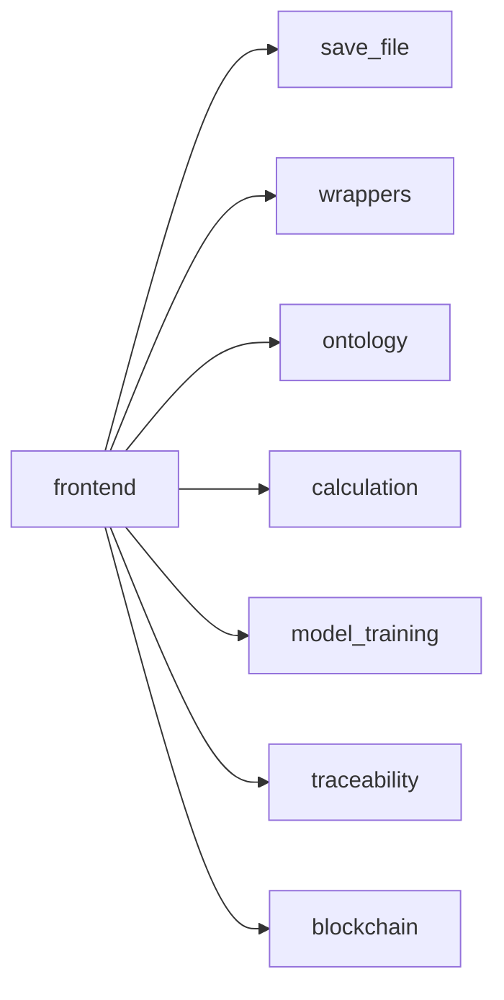

# 00 — Grafo de dependências internas

```mermaid
flowchart LR
  FE[frontend]
  SF[save_file]
  WR[wrappers]
  ON[ontology]
  CA[calculation]
  MT[model_training]
  TR[traceability]
  BC[blockchain]
  FE --> SF
  FE --> WR
  FE --> ON
  FE --> CA
  FE --> MT
  FE --> TR
  FE --> BC
```

Integração in-process (sem HTTP). Blockchain somente após `FINAL_ONTOLOGY_PUBLISHED`.
